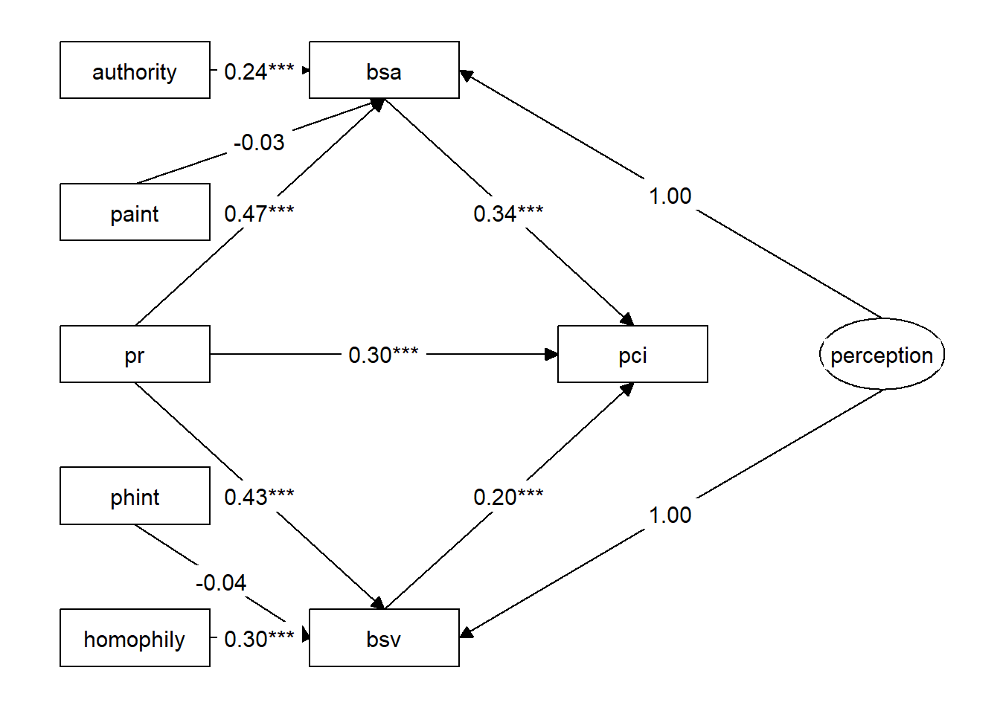
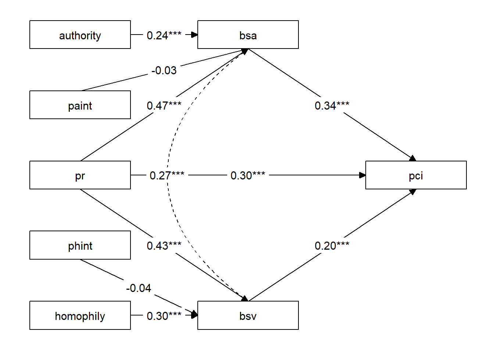

# Issue 1: The potential issues of introducing correlations in path analysis

## Equivalence of Correlation and Latent Variable
Researchers often introduce correlation coefficients in pathways. In other words, they abstract a latent variable that predicts the correlated variables with the same loadings. For example, adding the correlation between variables BSA and BSV in a structural equation model is equivalent to creating a latent variable "perception" to predict BSA and BSV.

### Data

```
## # A tibble: 6 × 8
##       pci     pr     bsv    bsa homophily authority  phint   paint
##     <dbl>  <dbl>   <dbl>  <dbl>     <dbl>     <dbl>  <dbl>   <dbl>
## 1 -0.270  -0.464  0.0132 -0.175    -0.288    0.0452  0.134 -0.0209
## 2  0.431   0.839 -0.223   0.600    -0.857    0.289  -0.718  0.242 
## 3 -1.67   -2.09  -2.11   -2.76     -1.51    -1.17    3.15   2.46  
## 4  0.0801  0.839 -2.35   -1.21      0.362    1.02    0.303  0.856 
## 5  0.781   1.16   0.249   0.342     0.118    1.26    0.137  1.47  
## 6  0.431  -0.464  0.249  -0.175     1.17    -0.199  -0.544  0.0921
```

### Model Defination

```r
path_model_la<-data_modmed%>%
  tidy_sem()%>%
  add_paths(
    perception=~a*bsv+a*bsa,#define latent variable
    pci~pr+b1*bsa+b2*bsv,
    bsv~a1*pr+w1*phint+homophily,
    bsa~a2*pr++w2*paint+authority
            )
path_fit_la<-path_model_la%>%
  estimate_lavaan()
```


```r
path_model_rela<-data_modmed%>%
  tidy_sem()%>%
  add_paths(
    bsv~~bsa,#define correlation
    pci~pr+b1*bsa+b2*bsv,
    bsv~a1*pr+w1*phint+homophily,
    bsa~a2*pr++w2*paint+authority
            )
path_fit_rela<-path_model_rela%>%
  estimate_lavaan()
```

### Results
#### latent variable

```r
lavaan::parameterestimates(path_fit_la)%>%
  filter(op%in%c("~"))%>%
  knitr::kable(digits=3)
```


|lhs |op |rhs       |label |    est|    se|      z| pvalue| ci.lower| ci.upper|
|:---|:--|:---------|:-----|------:|-----:|------:|------:|--------:|--------:|
|pci |~  |pr        |      |  0.297| 0.047|  6.342|  0.000|    0.205|    0.389|
|pci |~  |bsa       |b1    |  0.336| 0.053|  6.381|  0.000|    0.233|    0.439|
|pci |~  |bsv       |b2    |  0.197| 0.050|  3.953|  0.000|    0.100|    0.295|
|bsv |~  |pr        |a1    |  0.430| 0.039| 10.899|  0.000|    0.353|    0.507|
|bsv |~  |phint     |w1    | -0.037| 0.030| -1.227|  0.220|   -0.096|    0.022|
|bsv |~  |homophily |      |  0.302| 0.033|  9.024|  0.000|    0.236|    0.367|
|bsa |~  |pr        |a2    |  0.472| 0.044| 10.671|  0.000|    0.386|    0.559|
|bsa |~  |paint     |w2    | -0.033| 0.030| -1.111|  0.267|   -0.091|    0.025|
|bsa |~  |authority |      |  0.243| 0.040|  6.057|  0.000|    0.165|    0.322|

```r
graph_sem(nodes=get_nodes(path_fit_la)%>%select(name,shape),
          edges=get_edges(path_fit_la)%>%
            dplyr::filter(str_detect(label_results,"(.BY.)|(.ON.)|(bsv.WITH.bsa)")),
          layout=get_layout(
            "authority", "bsa", "","",
            "paint", "", "", "",
            "pr", "", "pci","perception", 
            "phint", "", "", "",
            "homophily", "bsv", "", "",
            rows = 5)
          )
```



#### correlation

```r
lavaan::parameterestimates(path_fit_rela)%>%
  filter(op%in%c("~"))%>%
  knitr::kable(digits=3)
```


|lhs |op |rhs       |label |    est|    se|      z| pvalue| ci.lower| ci.upper|
|:---|:--|:---------|:-----|------:|-----:|------:|------:|--------:|--------:|
|pci |~  |pr        |      |  0.297| 0.047|  6.342|  0.000|    0.205|    0.389|
|pci |~  |bsa       |b1    |  0.336| 0.053|  6.381|  0.000|    0.233|    0.439|
|pci |~  |bsv       |b2    |  0.197| 0.050|  3.953|  0.000|    0.100|    0.295|
|bsv |~  |pr        |a1    |  0.430| 0.039| 10.899|  0.000|    0.353|    0.507|
|bsv |~  |phint     |w1    | -0.037| 0.030| -1.227|  0.220|   -0.096|    0.022|
|bsv |~  |homophily |      |  0.302| 0.033|  9.024|  0.000|    0.236|    0.367|
|bsa |~  |pr        |a2    |  0.472| 0.044| 10.671|  0.000|    0.386|    0.559|
|bsa |~  |paint     |w2    | -0.033| 0.030| -1.111|  0.267|   -0.091|    0.025|
|bsa |~  |authority |      |  0.243| 0.040|  6.057|  0.000|    0.165|    0.322|

```r
graph_sem(nodes=get_nodes(path_fit_rela)%>%select(name,shape),
          edges=get_edges(path_fit_rela)%>%
            dplyr::filter(str_detect(label_results,"(.BY.)|(.ON.)|(bsv.WITH.bsa)")),
          layout=get_layout(
            "authority", "bsa", "","",
            "paint", "", "", "",
            "pr", "", "pci","", 
            "phint", "", "", "",
            "homophily", "bsv", "", "",
            rows = 5)
          )
```



## Discussion
Since introducing correlations is equivalent to latent variables, this process effectively splits the variables BSA and BSV into two parts: common factors and residuals. Given that BSA and BSV both represent the perceptual processes of brands, when introducing a correlation between brand perceptions, it is takin to removing the common factor, which is perception, shared by BSA and BSV. In such cases, the variable may undergo changes. Therefore, caution should be exercised when introducing correlations between variables.
